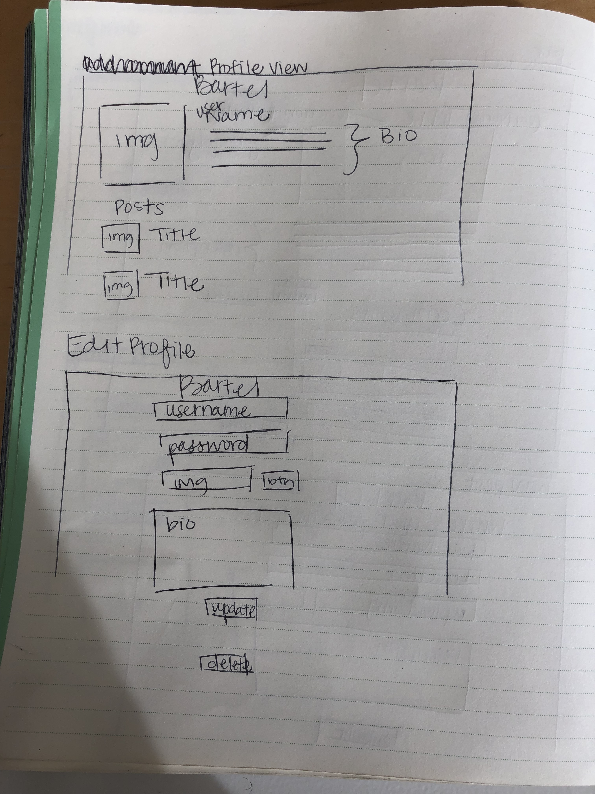

Bartel
====
### Unit 2 Project by Atarius Armstrong

Bartel is a fullstack application where users can log their favorite bars and restaurants to go day drinking. As someone who enjoy's a daytime beverage while on vacation, I figured it would be useful to have an app where people can see where they might want to visit while on vacation.

[Heroku Deployment](https://frozen-shore-29155.herokuapp.com/)

[Trello](https://trello.com/invite/b/kVZGyFpn/e114a3744888011123c2be4e751238fe/bartel-unit-2-project)

ERD
---

Wireframe
---

Dependencies
---
* Express
* Node.js
* Method Override

Technologies Used
---
* Language: HTML5, CSS3, Javascript
* Design: Google Fonts, CoolHue
* Royalty free images: Pexels

Future Development
---
* User authentication to prevent manipulation of other users' profiles, bar posts, and comments.
* Social exchange through user's profiles
* Add ratings to bars
* Allow user's to click a button for bars that they've been to that would then be added to their profiles.

Challenges Faced
---
When creating CSS for this application, it would render for the majority of the application except for the User's profiles, the editing page for the bar posts, and the page for the bars' comments. So for those particular views I had to manually insert the stylings.
